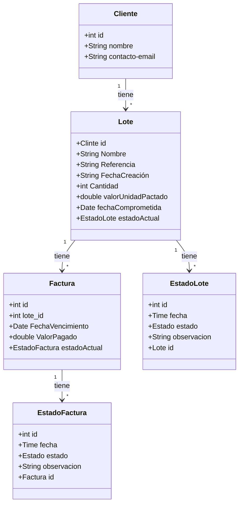

# arnold
Simple ERP for texting operations 

```mermaid
classDiagram
    class Cliente {
        +int id
        +String nombre
        +String contacto-email
    }

    class Lote {
        +Clinte id
        +String Nombre
        +String Referencia
        +String FechaCreación
        +int Cantidad
        +double valorUnidadPactado
        +Date fechaComprometida
        +EstadoLote estadoActual
    }

    class Factura {
        +int id
        +int lote_id
        +Date FechaVencimiento
        +double ValorPagado
        +EstadoFactura estadoActual
    }

    class EstadoFactura {
        +int id
        +Time fecha
        +Estado estado
        +String observacion
        +Factura id
    }

        class EstadoLote {
        +int id
        +Time fecha
        +Estado estado
        +String observacion
        +Lote id
    }

    

    Cliente "1" --> "*" Lote: tiene
    Lote "1" --> "*"Factura : tiene
    Lote "1" --> "*"EstadoLote : tiene
    Factura "1" --> "*"EstadoFactura : tiene
```
